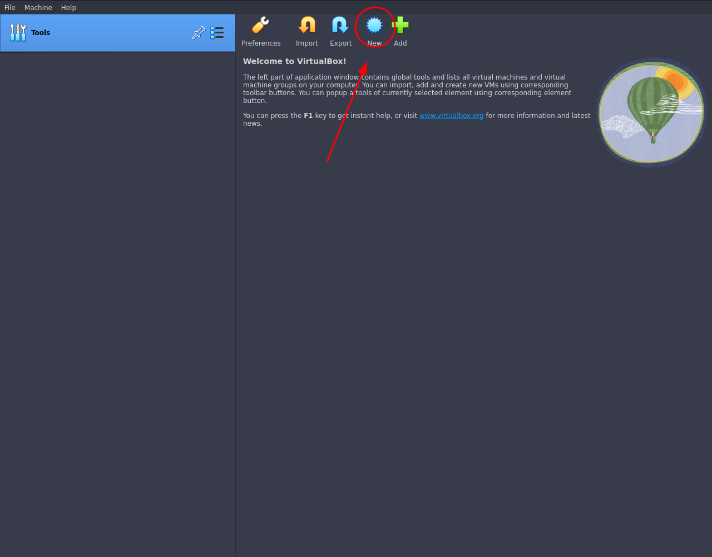
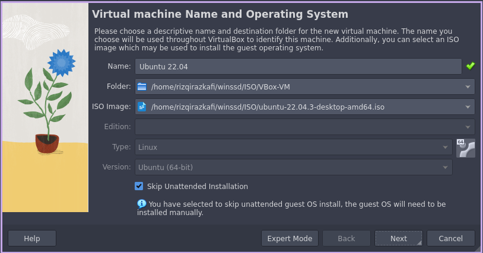
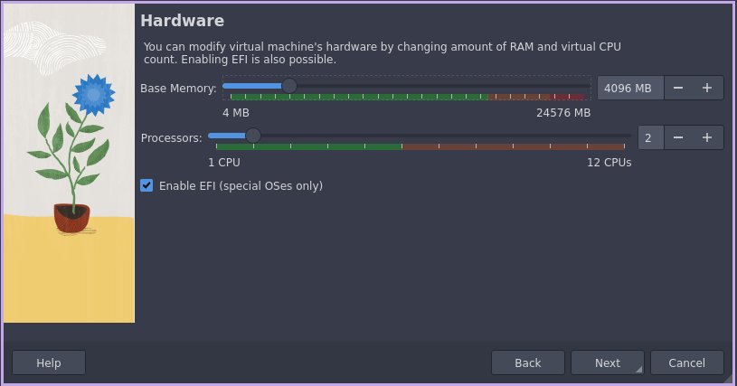
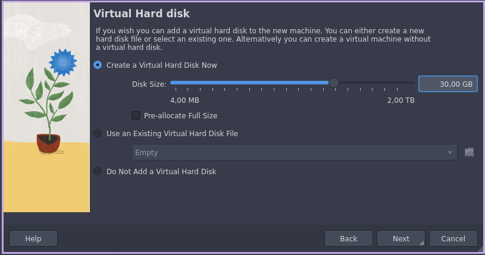
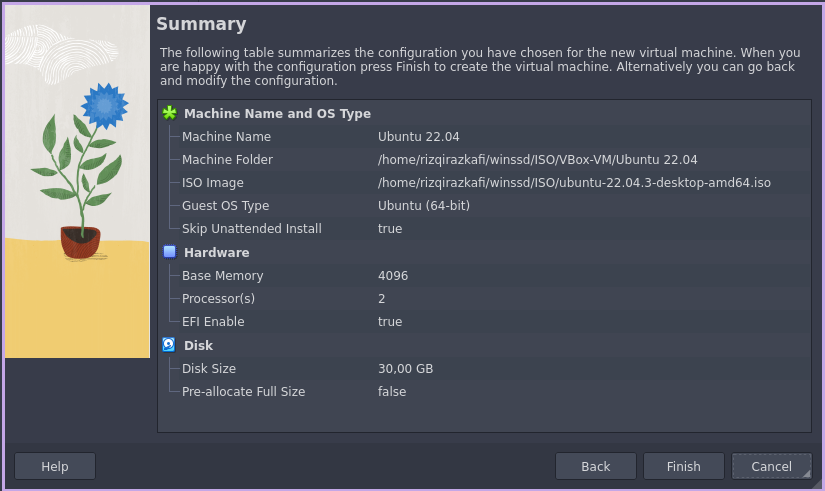
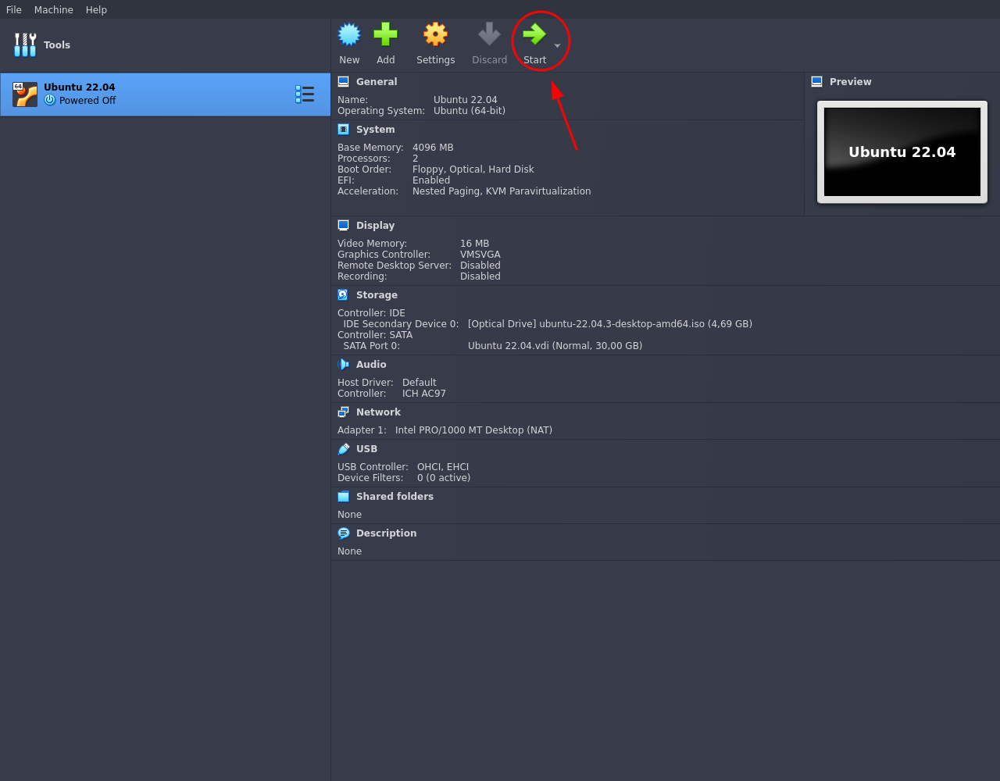

# Linux

## Praktikum 1.1

### Instalasi Ubuntu
**Persiapan:**
1. Device dengan spesifikasi minimum 4 Core CPU, 8GB RAM, 50GB Free-space, 8GB USB.
1. Mahasiswa menginstall salah satu Virtual-Machine Manager ([VirtualBox](https://www.virtualbox.org/wiki/Downloads), [VMware](https://www.vmware.com/products/workstation-player.html), [virt-manager](https://virt-manager.org/))
1. Mahasiswa mendownload ISO salah satu distribusi GNU/Linux (Disarankan [Ubuntu](https://ubuntu.com/desktop)).

**Membuat bootable device**
1. Download [Ventoy](https://www.ventoy.net/en/download.html) untuk membuat bootable device.
1. Extract archive dengan [WinRAR](https://www.rarlab.com/download.htm), [Peazip](https://peazip.github.io/index.html), atau [GNU tar](https://savannah.gnu.org/git/?group=tar).
1. Jalankan executable ventoy-GUI.
1. Ubah flashdisk menjadi ventoy device
1. Copy ISO kedalam flashdisk

**Persiapan Instalasi BareMetal**
1. Tancapkan flashdisk ke port USB sebelum menyalakan PC
1. Tekan/spam/tahan tombol BIOS
1. Ubah boot order ke USB device
1. Simpan dan keluar
1. Nyalakan kembali PC

**Persiapan Instalasi VirtualBox**
1. Buat Virtual Machine baru

1. Beri nama VM (Bebas)
1. Pilih lokasi disk vm
1. Pilih ISO Image
1. Check (Skip Unattended Installation)

1. Next
1. Deklarasi Spesifikasi minimal 2-core, 4GB RAM

> Enable EFI jika PC mendukung UEFI
1. Deklarasi storage minimal 25GB

1. Rangkuman

1. Finish
1. Klik "Start" untuk memulai VM

**Instalasi Ubuntu**
