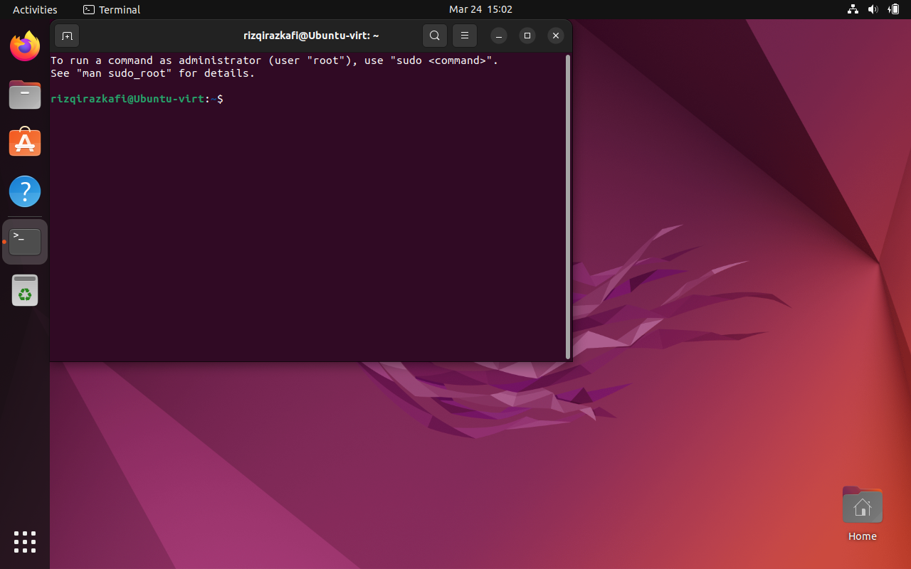

# Dasar Penggunaan Terminal GNU/Linux
Pada dokumen ini, akan diberikan dasar-dasar penggunaan terminal.

## Definisi
[Terminal Emulator](https://en.wikipedia.org/wiki/Terminal_emulator) atau
aplikasi terminal adalah perangkat lunak komputer yang mengemulasikan Video
Terminal di arsitektur tampilan lainnya. Beberapa sinonim untuk penyebutan
terminal antara lain adalah
[shell](https://en.wikipedia.org/wiki/Command-line_interface) atau [text
terminal](https://en.wikipedia.org/wiki/Text_terminal), penyebutan terminal
melingkupi semua remote terminal, termasuk antarmuka grafis. Sebuah terminal 
emulator dalam GUI sering disebut dengan __terminal window__. Ialah sebuah 
jendela yang memberikan kita akses pada text terminal dan semua aplikasinya
seperti [command-line
interfaces](https://en.wikipedia.org/wiki/Command-line_interface) (CLI).

> Intinya adalah, terminal adalah aplikasi bentuk teks yang bisa kita gunakan
> untuk menjalankan perintah yang kita inginkan.

## Membuka Terminal

Pada sistem operasi Ubuntu, kita dapat membuka terminal dengan shortcut/keybinding
__ctrl + t__. Ini juga berlaku di beberapa Desktop Environment lainnya seperti 
KDE dan XFCE.

Segala hal yang kita lakukan dalam terminal mayoritas hanya bisa menggunakan
keyboard. Karena memang inilah intisari dari terminal, yaitu _keyboard centric_.

Ubuntu secara default menggunakan
[Bash](https://en.wikipedia.org/wiki/Bash_(Unix_shell)) sebagai shell. Tugas
dasar dari shell adalah mengeksekusi perintah yang kita jalankan. Banyak sekali
shell yang ada diluar sana seperti ZSH, FISH, DASH, nu-shell, dll. Namun untuk
kali ini, kita hanya akan menggunakan Bash sebagai shell yang paling banyak dipakai
sebagai shell bawaan distribusi GNU/Linux.

## Komponen Shell (BASH)
Dalam shell, kita bisa melihat beberapa komponen yaitu username@host-name,
kemudian diikuti oleh tanda "~" yang menandakan bahwa kita sekarang sedang berada
di HOME directory user kita. Kemudian ada tanda dollar (\$) yang menandakan bahwa
perintah yang kita jalankan merupakan sebagai user biasa dan bukan root/super user.

