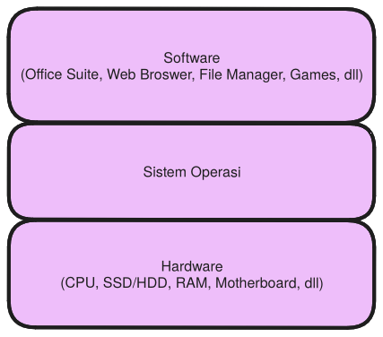

# Pengantar Sistem Operasi (Praktikum)
Repositori ini berisi pendahuluan tentang sistem operasi untuk komputer yaitu 
Windows dan GNU/Linux. Untuk sistem operasi lain seperti FreeBSD, MacOS, maupun
sistem operasi perangkat *mobile* seperti Android, iOS, iPadOS, tidak akan
dibahas disini.

## Definisi Sistem Operasi 
Mudahnya, sistem operasi merupakan penengah antara perangkat keras *hardware* dengan perangkat lunak *software*.
Sistem operasi lah yang menjadi perantara antara pengguna dengan komputer. 
Tanpa sistem operasi, maka komputer tidak dapat digunakan.
> Note: Secara teknis, komputer masih memungkinkan digunakan tanpa sistem operasi, namun ini butuh
> usaha yang besar untuk dilakukan dan tidak efisien untuk kebutuhan kebanyakan
> pengguna.

Gambar diatas merupakan ilustrasi sederhana posisi sistem operasi dalam sebuah komputer.
Sistem Operasi mengatur bagaimana *software* berbicara dengan *hardware*. Tanpa 
sistem operasi, maka *software* harus ditulis menyesuaikan *hardware* tempat 
*software* tersebut dijalankan. Hal ini sangat tidak efisien dan menyebabkan
ketidak serasian cara antara masing-masing *software* berbicara dengan *hardware*

